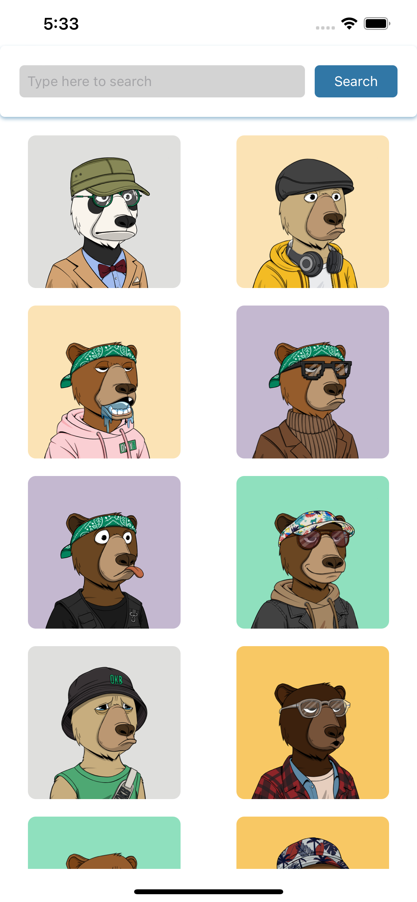
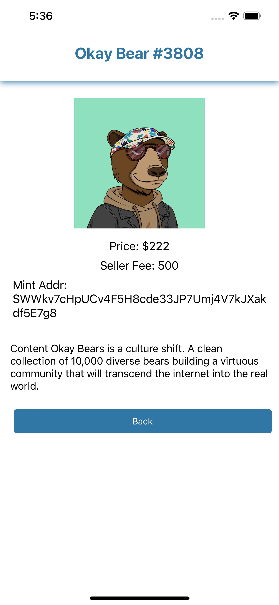

# Prime Fit Assignment NFT Collection App

## Table of Contents

- [Features](#features)
- [Prerequisites](#prerequisites)
- [Getting Started](#getting-started)
- [Usage](#usage)
- [Screenshots](#screenshots)

## Features

- Browse and search for NFT collections.
- Infinite scroll for paginated data.
- View NFT collection details.
- Implements React Navigation.
- Reusable search bar component.
- Loading indicators.

## Prerequisites

- Node.js and npm installed.
- React Native development environment set up.
- Android/iOS emulator or physical device for testing.

## Getting Started

1. Clone the repository.
2. Change to the project directory.
3. Install dependencies.
4. Run the app.

## Usage

1. Browse NFT collections.
2. Search for specific collections.
3. View collection details.

## Screenshots

